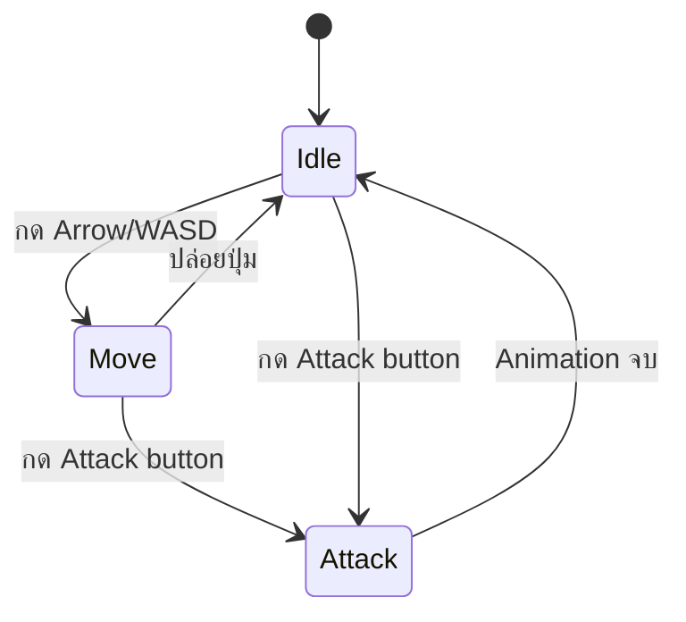

# Mechanic Design — [Movement / Action]

## State Diagram

## Rules

| State  | เข้าเงื่อนไข                        | ออกเงื่อนไข | Note           |
| ------ | ----------------------------------------------- | ---------------------- | -------------- |
| Idle   | เริ่มเกม / หยุดเคลื่อนที่ | กด input ใดๆ      | Animation loop |
| Move   | กดปุ่มทิศทาง                        | ปล่อยปุ่ม     | Speed = [40]   |
| Attack | กด Left mouse                                 | ปล่อย Left mouse | Damage = [100] |
