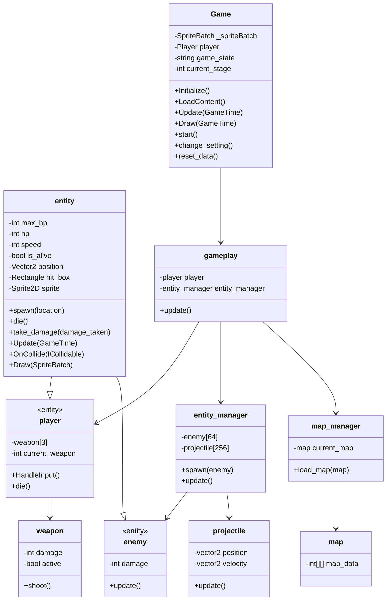

# Class Diagram — [Cell Shooter]

```mermaid
classDiagram
    class Game {
        -SpriteBatch _spriteBatch
        -Player player
	-string game_state
	-int current_stage 

        +Initialize()
        +LoadContent()
        +Update(GameTime)
        +Draw(GameTime)
	+start()
	+change_setting()
	+reset_data()
    }
    class entity {
	-int max_hp
        -int hp
	-int speed
        -bool is_alive
	-Vector2 position
	-Rectangle hit_box
      	-Sprite2D sprite

	+spawn(location)
	+die()
	+take_damage(damage_taken)
	+Update(GameTime)
        +OnCollide(ICollidable)
	+Draw(SpriteBatch)
    }
    class player {
	<<entity>>
	-weapon[3]
	-int current_weapon

        +HandleInput()
	+die()
    }
    class enemy {
	<<entity>>
	-int damage

        +update()
    }
    class gameplay {
	-player player
	-entity_manager entity_manager

	+update()
    }
    class entity_manager {
	-enemy[64]
	-projectile[256]

	+spawn(enemy)
	+update()
    }
    class projectile {
	-vector2 position
	-vector2 velocity

	+update()
    }
    class map_manager {
	-map current_map

	+load_map(map)
    }
    class map {
	-int[][] map_data

    }
    class weapon{
	-int damage
	-bool active

	+shoot()
    }
    gameplay --> player
    entity --|> player
    entity --|> enemy
    Game --> gameplay
    gameplay --> entity_manager
    entity_manager --> enemy
    entity_manager --> projectile
    gameplay --> map_manager
    map_manager --> map
    player --> weapon
```
